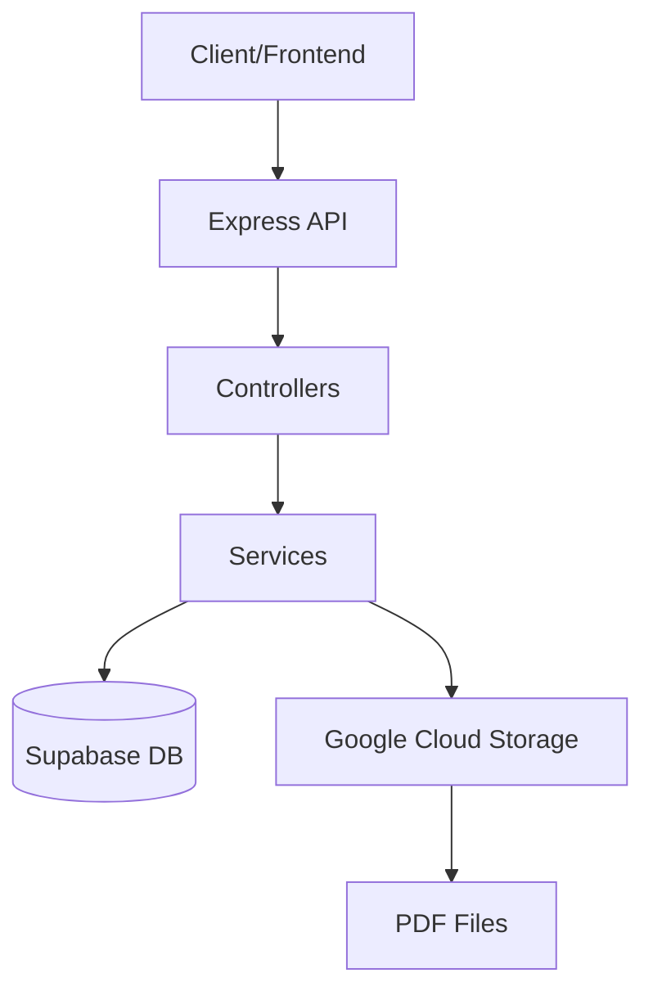
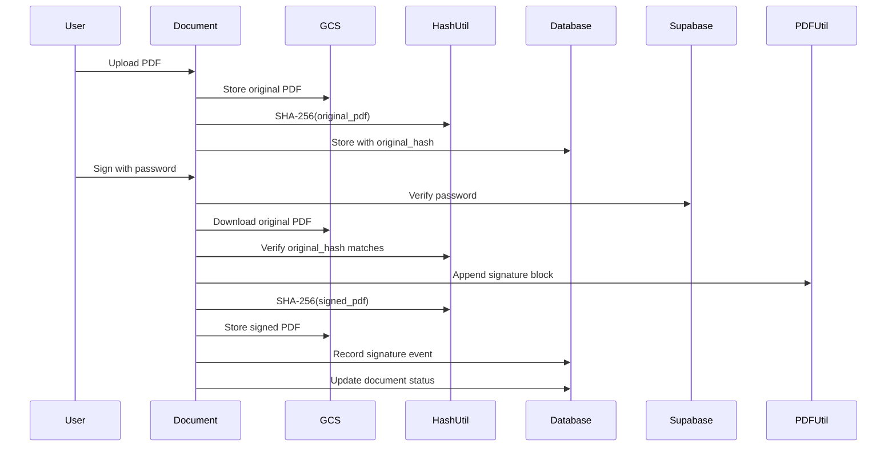

# AGENTS.md - SignSystem Backend Development Guide

This file provides comprehensive guidelines for agentic coding agents operating on the SignSystem backend project.

---

## 1. Project Overview

SignSystem is a document signing platform for payroll documents. It enables employees to securely view and digitally sign their payroll documents with cryptographic hash verification.

### Architecture



### Technology Stack

- **Runtime**: Node.js with TypeScript
- **Framework**: Express.js 5.x
- **Database**: Supabase (PostgreSQL with `ar_signatures` schema)
- **Storage**: Google Cloud Storage for PDFs
- **Testing**: Jest with ts-jest
- **Package Manager**: npm

### Project Structure

```
backend/
├── src/
│   ├── app.ts           # Express app configuration
│   ├── server.ts        # Server entry point
│   ├── config/          # Configuration files (Supabase client)
│   ├── controllers/     # Request handlers
│   ├── middleware/      # Auth middleware
│   ├── repositories/    # Database operations
│   ├── services/        # Business logic
│   ├── types/           # TypeScript type definitions
│   └── utils/           # Utility functions (GCS, PDF, Hash, Logger)
├── __tests__/           # Test files (mirrors src structure)
├── db/
│   ├── ddls/            # Schema definitions
│   └── migrations/      # Data migrations
└── collections/          # Postman collections
```

### Key Features

1. **Document Upload**: Upload payroll PDFs with idempotency checks
2. **Document Signing**: Cryptographic signing with SHA-256 hash verification
3. **Signature Audit**: Records all signature events with IP, user agent, and metadata
4. **Document Lifecycle**: Supersedes old documents when new ones are uploaded for the same period

---

## 2. Build and Test Commands

### Installation

```bash
cd backend
npm install
```

### Development

```bash
# Start development server with hot reload
npm run dev

# Build TypeScript to dist/
npm run build

# Start production server
npm start
```

### Testing

```bash
# Run all tests
npm test

# Run tests in watch mode
npm run test:watch

# Run tests with coverage
npm run test:coverage
```

### Environment Variables

Required environment variables (see `.env.example`):

```env
# Supabase Configuration
SUPABASE_URL=your_supabase_url
SUPABASE_SERVICE_ROLE_KEY=your_service_role_key
SUPABASE_ANON_KEY=your_anon_key

# Google Cloud Storage
GCS_PROJECT_ID=your_gcs_project_id
GCS_BUCKET_NAME=your_bucket_name
GCS_KEY_FILE=path_to_gcs_key_file

# Server
PORT=3000
NODE_ENV=development
```

---

## 3. Code Style Guidelines

### TypeScript Configuration

The project uses [`tsconfig.json`](backend/tsconfig.json) with strict mode enabled:

```json
{
  "compilerOptions": {
    "target": "ES2020",
    "module": "commonjs",
    "strict": true,
    "esModuleInterop": true,
    "declaration": true,
    "sourceMap": true
  }
}
```

### Imports

Use **absolute imports** with relative paths for project modules:

```typescript
// ✅ Correct - use relative paths from src/
import { DocumentRepository } from '../repositories/DocumentRepository'
import { DocumentService } from '../services/DocumentService'
import { Document } from '../types'

// ❌ Avoid - absolute paths not configured
import { Document } from 'src/types'
```

Import ordering (automatic sorting is configured via project structure):

1. External dependencies
2. Internal modules (relative imports)

### Formatting

- Use **2 spaces** for indentation
- Use **single quotes** for strings
- Use **semicolons** at statement ends
- Maximum line length: 100 characters
- Use **trailing commas** in multi-line objects/arrays

```typescript
// ✅ Correct
const documentData = {
  id: documentId,
  user_id: request.user_id,
  employee_id: request.employee_id,
}

// ❌ Incorrect
const documentData = {
    "id": documentId,
    'user_id': request.user_id
}
```

### Types

#### Interface vs Type Alias

Use **interfaces** for object shapes and **types** for unions, intersections, or primitives:

```typescript
// ✅ Interface for objects
export interface Document {
  id: string
  user_id: string
  status: 'PENDING' | 'SIGNED' | 'INVALIDATED'
}

// ✅ Type for unions
export type SupabaseResult<T = any> = {
  data: T | null
  error: Error | null
}
```

#### Explicit Return Types

Always specify return types for public functions:

```typescript
// ✅ Correct
async listUserDocuments(userId: string): Promise<Document[]> {
  return await this.documentRepository.getDocumentsByUser(userId)
}

// ❌ Avoid - implicit return type
async listUserDocuments(userId: string) {
  return await this.documentRepository.getDocumentsByUser(userId)
}
```

### Naming Conventions

| Construct | Convention | Example |
|-----------|------------|---------|
| Classes | PascalCase | `DocumentService`, `DocumentController` |
| Interfaces | PascalCase | `Document`, `SignDocumentRequest` |
| Type Aliases | camelCase | `SupabaseResult`, `UploadDocumentResponse` |
| Functions | camelCase | `listUserDocuments`, `uploadDocument` |
| Variables | camelCase | `documentId`, `pdfBuffer` |
| Constants | SCREAMING_SNAKE_CASE | `MAX_FILE_SIZE`, `SUPPORTED_FORMATS` |
| Private Methods/Properties | camelCase with `_` prefix | `private _supabaseClient` |
| Database Columns | snake_case | `pdf_original_path`, `signed_at` |

#### Status Values

Use string literal types for status fields:

```typescript
status: 'PENDING' | 'SIGNED' | 'INVALIDATED'
```

### Error Handling

#### Service Layer

Throw `Error` objects with descriptive messages:

```typescript
// ✅ Correct - throw errors with messages
if (!document) {
  throw new Error('Document not found')
}
if (document.status === 'SIGNED') {
  throw new Error('Document is already signed')
}

// ✅ Include contextual information
Logger.error('Failed to update document', { error: error.message, documentId })
```

#### Controller Layer

Map error messages to HTTP status codes:

```typescript
// ✅ Correct - map errors to status codes
catch (error: any) {
  const statusCode = error.message.includes('not found') ? 404 :
                    error.message.includes('already signed') ? 400 :
                    error.message.includes('Authentication failed') ? 401 : 500
  res.status(statusCode).json({ error: error.message })
}
```

#### Never Swallow Errors

Always log and rethrow errors:

```typescript
// ✅ Correct - log and rethrow
catch (error) {
  console.error(`[DocumentService] Error: ${error.message}`)
  throw error
}

// ❌ Avoid - silent error swallowing
catch (error) {
  // no handling
}
```

### Async/Await

- Use `async/await` over raw Promises
- Avoid unnecessary `await` when not needed
- Handle promise rejections with try/catch

```typescript
// ✅ Correct - await at top level
async signDocument(...) {
  try {
    const document = await this.repository.getDocumentById(documentId, userId)
    if (!document) {
      throw new Error('Document not found')
    }
    // ... more operations
  } catch (error) {
    throw error
  }
}
```

### Logging

Use the [`Logger`](backend/src/utils/logger.ts) utility for consistent logging:

```typescript
import Logger from '../utils/logger'

// ✅ Use Logger for structured logging
Logger.info('Document uploaded', { documentId, userId })
Logger.error('Upload failed', { error: error.message })

// ✅ Sanitize sensitive data automatically
Logger.logApiRequest(req)  // Removes password, token, secret fields
```

### Database Operations

#### Repository Pattern

All database operations go through repositories:

```typescript
// ✅ Correct - use repositories
export class DocumentRepository {
  constructor(private userToken: string) {}

  async getDocumentById(documentId: string, userId: string): Promise<Document | null> {
    const { data, error } = await this.supabaseClient
      .schema('ar_signatures')
      .from('documents')
      .select('*')
      .eq('id', documentId)
      .eq('user_id', userId)
      .single()

    if (error) {
      Logger.error('Failed to get document', { error: error.message, documentId })
      throw error
    }
    return data
  }
}
```

#### Handle PGRST116

PostgreSQL's "row not found" error code (`PGRST116`) should return `null`, not throw:

```typescript
if (error) {
  if (error.code === 'PGRST116') return null  // Not found
  Logger.error('Failed to get document', { error: error.message })
  throw error
}
```

### File Uploads

Use Multer for file handling:

```typescript
// ✅ Validate file exists
if (!pdfFile || !pdfFile.buffer) {
  return res.status(400).json({ error: 'PDF file is required' })
}

// ✅ Validate required fields
if (!user_id || !employee_id || !payroll_period_start || !payroll_period_end) {
  return res.status(400).json({ error: 'All fields are required' })
}
```

### Date Formats

The system uses `DD-MM-YYYY` format for payroll period dates in the API, but PostgreSQL expects `MM-DD-YYYY` format.

Use the [`DateUtil`](backend/src/utils/date.ts) class for conversion:

```typescript
import { DateUtil } from '../utils/date'

// Input from API (DD-MM-YYYY)
const payrollPeriodStart = '31-01-2025'  // January 31, 2025

// Convert to PostgreSQL format (MM-DD-YYYY)
const postgresFormat = DateUtil.toPostgresFormat(payrollPeriodStart)
// Result: '01-31-2025'

// Convert back from PostgreSQL to API format
const apiFormat = DateUtil.fromPostgresFormat(postgresFormat)
// Result: '31-01-2025'
```

**Flow:**
1. API receives dates in `DD-MM-YYYY` format
2. Convert to `MM-DD-YYYY` before sending to database
3. Convert back to `DD-MM-YYYY` for API responses


### Testing

#### Test Structure

Mirror the `src/` structure in `__tests__/`:

```
__tests__/
├── controllers/
│   └── DocumentController.test.ts
├── services/
│   └── DocumentService.test.ts
├── repositories/
│   ├── DocumentRepository.test.ts
│   └── DocumentAdminRepository.test.ts
└── utils/
    ├── gcs.test.ts
    └── hash.test.ts
```

#### Test Patterns

```typescript
// ✅ Use describe blocks for organization
describe('DocumentService', () => {
  describe('uploadDocument', () => {
    it('should throw error for invalid date range', async () => {
      // test implementation
    })
  })
})

// ✅ Use beforeEach for setup
beforeEach(() => {
  jest.clearAllMocks()
})
```

#### Mocking

Use Jest mocks for external dependencies:

```typescript
// ✅ Mock Supabase client
jest.mock('../config/supabase', () => ({
  createSupabaseUserClient: jest.fn(),
  createSupabaseAdminClient: jest.fn(),
}))

// ✅ Mock UUID
jest.mock('uuid', () => ({
  v4: jest.fn(() => 'test-uuid')
}))
```

### Git Conventions

- **Branch names**: `feature/description` or `fix/description`
- **Commits**: Use conventional commits (`feat:`, `fix:`, `docs:`)
- **PRs**: Include description and test results

### Security Considerations

1. **Never log sensitive data**: Passwords, tokens, secrets are automatically redacted
2. **Validate all inputs**: Especially file uploads and user data
3. **Use service_role sparingly**: Only for admin operations
4. **RLS is enabled**: User-facing operations must respect Row Level Security

---

## 4. Common Patterns

### Idempotent Upload

The system handles idempotency by checking hash:

```typescript
// 1. Compute hash of PDF
const originalHash = HashUtil.sha256(request.pdf)

// 2. Check if document with same hash exists
const existingDoc = await adminRepo.checkIdempotency(
  request.user_id,
  request.payroll_period_start,
  request.payroll_period_end,
  originalHash
)

if (existingDoc) {
  return { ...existingDoc, idempotent: true }
}
```

### Rollback on Error

If an operation fails after partial completion, roll back all changes:

```typescript
// Upload file first, then track if successful
const signedPath = `signed/${userId}/${documentId}.pdf`
let signedPathUploaded: string | null = null

try {
  await GCSUtil.uploadPdf(signedPath, signedPdfBuffer)
  signedPathUploaded = signedPath

  // Database operations that might fail
  await this.repository.insertSignature({ ... })
  await this.repository.updateDocumentAsSigned(documentId, signedHash, signedAt)
} catch (error) {
  // Rollback: delete uploaded file if it was uploaded
  if (signedPathUploaded) {
    try {
      await GCSUtil.deletePdf(signedPathUploaded)
    } catch (rollbackError) {
      console.error(`Failed to rollback GCS file - ${rollbackError.message}`)
    }
  }
  throw error
}
```

**Important**: When signing a document, the signed PDF must NOT remain in GCS if the signature record fails to insert. The signed PDF and database state must always be consistent.

### Signature Verification Flow



---

## 5. Database Schema

See [`DATABASE_MODEL.md`](backend/DATABASE_MODEL.md) for detailed schema documentation.

### Quick Reference

| Table | Purpose |
|-------|---------|
| `ar_nomina.employees` | Employee information |
| `ar_signatures.profiles` | Links auth.users to employees |
| `ar_signatures.documents` | Payroll documents with status |
| `ar_signatures.signatures` | Audit log of signature events |


---

## 6. Postman Collection

Import [`collections/SignSystem_Postman.postman_collection.json`](backend/collections/SignSystem_Postman.postman_collection.json) for API testing.

